# 資料結構與演算法 II 考前整理筆記

整理範圍：

- `sssp_apsp.pdf`：SSSP、Bellman-Ford、DAG shortest path、Warshall、Floyd-Warshall
- `max_flow.pdf`：Maximum flow、Ford-Fulkerson、Edmonds-Karp、Min-cut、Bipartite matching
- `dinamic_programming.pdf` / `quiz2_dinamic.pdf`：Dynamic programming、Rod cutting、Fibonacci
- `111_2_資結第2次小考.pdf`、`111_2_資結第3次小考.pdf`：只抽出與本次課程相關的題型講解

筆記順序依照你的要求改成：

```text
SSSP/APSP -> Maximum Flow -> Dynamic Programming
```

---

# Part 1. SSSP / APSP 最短路徑

## 1. 最短路徑核心：Relaxation 放鬆

最短路徑演算法幾乎都在做同一件事：看能不能用一條邊讓距離變更短。

假設有邊 `(u, v)`，權重是 `w(u,v)`：

```text
if v.d > u.d + w(u,v):
    v.d = u.d + w(u,v)
    v.pi = u
```

意思：

- `u.d`：目前 source 到 `u` 的最短估計距離
- `v.d`：目前 source 到 `v` 的最短估計距離
- `v.pi`：最短路徑上 `v` 的前一個點

圖像：

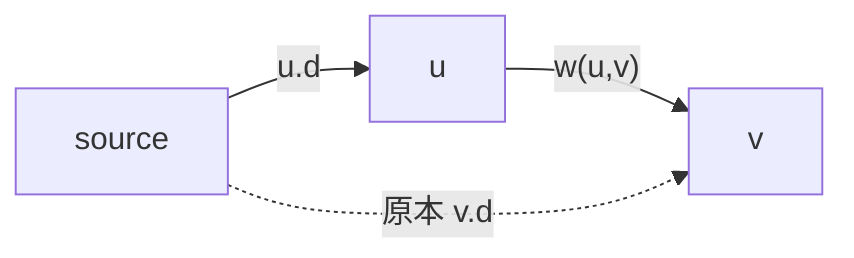

如果：

```text
source -> u -> v
```

比原本知道的 `source -> v` 更短，就更新 `v`。

---

## 2. Dijkstra 的限制

Dijkstra 的特色：

- 每次選目前距離最小、還沒確定的點。
- 選到後就把它當成「最短距離已確定」。
- 只適用於沒有負權重邊的圖。

為什麼不能有負邊？

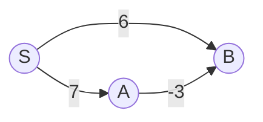

如果先看到 `S -> B = 6`，可能以為 B 已經夠短。  
但其實：

```text
S -> A -> B = 7 + (-3) = 4
```

後面負邊會讓之前看似確定的答案變短，所以 Dijkstra 會失效。

---

## 3. Bellman-Ford Algorithm

## 3.1 用途

Bellman-Ford 用來解 SSSP, Single-Source Shortest Paths。

可以處理：

- 有向圖
- 負權重邊
- 偵測從 source 可到達的負權重 cycle

不能處理：

- 有負環時，不存在有限的最短路徑，因為可以一直繞負環讓距離變成負無限大。

---

## 3.2 演算法

```text
BELLMAN-FORD(G, w, s)
1. Initialize-Single-Source(G, s)
2. for i = 1 to |V|-1:
3.     for each edge (u, v) in E:
4.         RELAX(u, v, w)
5. for each edge (u, v) in E:
6.     if v.d > u.d + w(u,v):
7.         return FALSE
8. return TRUE
```

為什麼是 `|V|-1` 輪？

因為如果沒有重複點，一條 simple path 最多只有 `|V|-1` 條邊。  
所以沒有負環時，最短路徑最多只需要經過 `|V|-1` 條邊。

時間複雜度：

```text
O(VE)
```

---

## 3.3 負環 Negative Cycle

如果做完 `|V|-1` 輪後，還有某條邊可以 relax，表示距離還能更短。

這代表有負環：

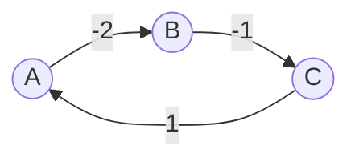

總權重：

```text
-2 + -1 + 1 = -2
```

每繞一次就少 2，所以最短路徑沒有答案。

---

## 4. DAG Shortest Path

## 4.1 DAG 是什麼？

DAG = Directed Acyclic Graph，有向無環圖。

特色：

- 邊有方向。
- 不存在 directed cycle。
- 因為沒有 cycle，所以一定沒有負環。

所以 DAG 即使有負權重邊，也可以算 shortest path。

---

## 4.2 Topological Sort 拓撲排序

如果有邊：

```text
u -> v
```

代表 `u` 必須排在 `v` 前面。

例：穿衣服順序。

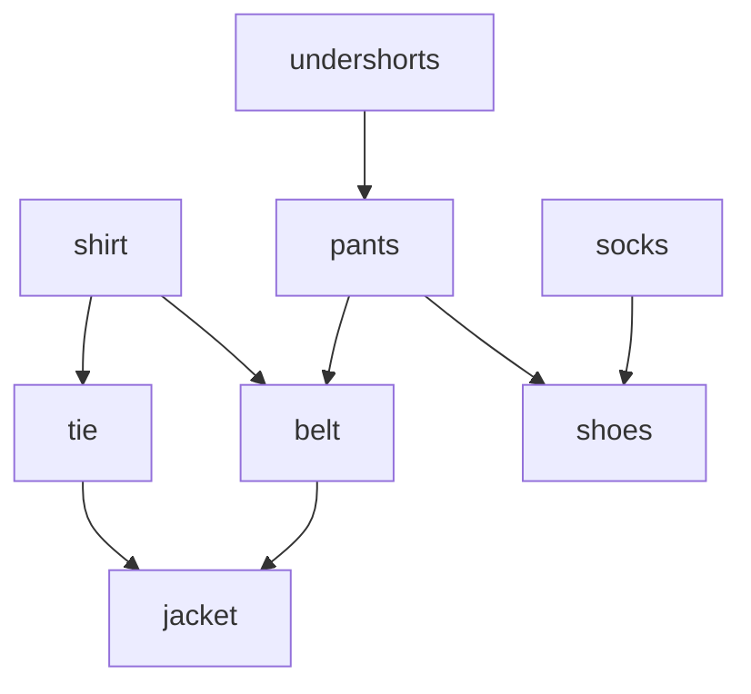

拓撲排序就是排出一個順序，使每條邊的起點都在終點前面。

---

## 4.3 DAG Shortest Path 演算法

```text
DAG-SHORTEST-PATHS(G, w, s)
1. Topologically sort vertices
2. Initialize-Single-Source(G, s)
3. for each u in topological order:
4.     for each v in Adj[u]:
5.         RELAX(u, v, w)
```

複雜度：

```text
O(V+E)
```

原因：拓撲排序一次，然後每條邊 relax 一次。

---

## 5. Warshall：Transitive Closure 遞移閉包

Warshall 解的是：

> 每一對點 `i, j` 之間是否存在一條路徑？

令：

```text
trans[i][j] = 1 表示 i 可以到 j
trans[i][j] = 0 表示目前不知道 i 能不能到 j
```

核心想法：

```text
如果 i 可以到 k，且 k 可以到 j
那 i 就可以到 j
```

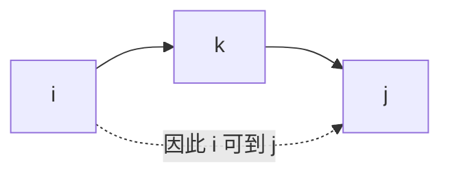

演算法：

```text
for k = 1 to n:
    for i = 1 to n:
        for j = 1 to n:
            trans[i][j] = trans[i][j] OR (trans[i][k] AND trans[k][j])
```

---

## 6. Floyd-Warshall Algorithm

## 6.1 用途

Floyd-Warshall 解 APSP, All-Pairs Shortest Paths。

也就是：

> 求每一對點 `i -> j` 的最短距離。

可以處理：

- 負權重邊

不能處理：

- 負環

---

## 6.2 DP 定義

令 `D[k][i][j]` 表示：

> 從 `i` 到 `j` 的最短距離，而且中繼點只能使用 `{1, 2, ..., k}`。

轉移式：

```text
D[k][i][j] = min(
    D[k-1][i][j],
    D[k-1][i][k] + D[k-1][k][j]
)
```

意思是比較兩種走法：

1. 不經過 `k`
2. 經過 `k`，也就是 `i -> k -> j`

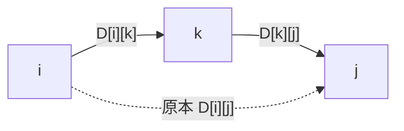

---

## 6.3 演算法

```text
FLOYD-WARSHALL(W)
    D = W
    for k = 1 to n:
        for i = 1 to n:
            for j = 1 to n:
                D[i][j] = min(D[i][j], D[i][k] + D[k][j])
    return D
```

複雜度：

```text
Time: O(n^3)
Space: O(n^2)
```

---

## 6.4 Predecessor Matrix Π 前驅矩陣

如果題目只問距離，看 `D` matrix。

如果題目問路徑，就要看 `Π` matrix。

初始化：

```text
Π[i][j] = NIL, if i == j or w[i][j] = ∞
Π[i][j] = i,   if i != j and w[i][j] < ∞
```

更新時：

```text
如果 D[i][j] 因為 i -> k -> j 變短：
    Π[i][j] = Π[k][j]
```

意思是：  
`i` 到 `j` 的最短路徑最後一段，會跟 `k` 到 `j` 的最後一段相同。

---

## 7. 考卷題型：第 2 次小考 Q1，從 H 出發求 SSSP

題目：從 vertex `H` 出發，求 single-source shortest path。

這題有負邊，例如：

```text
H -> F = -4
H -> B = -1
B -> C = -4
```

所以不要用 Dijkstra。保守做法是用 Bellman-Ford。

題目圖可整理成：

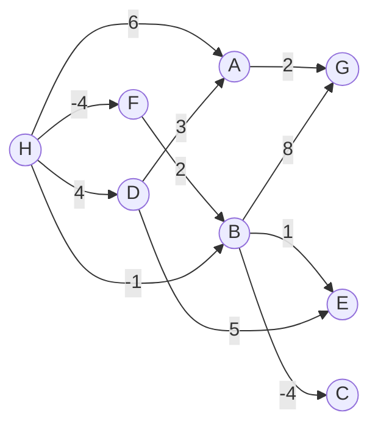

從 `H` 出發的距離結果：

| 點 | 最短距離 | 一條最短路徑 |
|---|---:|---|
| H | 0 | H |
| F | -4 | H -> F |
| B | -2 | H -> F -> B |
| C | -6 | H -> F -> B -> C |
| E | -1 | H -> F -> B -> E |
| D | 4 | H -> D |
| A | 6 | H -> A |
| G | 6 | H -> F -> B -> G |

考試寫法：

1. 初始化 `H.d = 0`，其他點 `∞`。
2. 每一輪照題目或自己固定順序 relax 所有邊。
3. 最多做 `|V|-1` 輪。
4. 寫出最後距離與 predecessor。

---

## 8. 考卷題型：第 2 次小考 Q2，Floyd-Warshall

題目要求：

> Solve APSP using Floyd-Warshall, show distance matrix `D` and predecessor matrix `Π` in each iteration.

這題不是只寫最後答案，而是要寫每個 `k` 的矩陣。

標準作答格式：

```text
D(0), Π(0)
D(1), Π(1)
D(2), Π(2)
D(3), Π(3)
D(4), Π(4)
```

每次固定問：

```text
是否 D[i][j] > D[i][k] + D[k][j] ?
```

如果是：

```text
D[i][j] = D[i][k] + D[k][j]
Π[i][j] = Π[k][j]
```

考試常見失分點：

- `∞ + 數字` 還是 `∞`，不能拿來更新。
- `Π` 不要寫成 `k`，通常要寫 `Π[k][j]`。
- 題目要每次 iteration，就不能只交最後矩陣。

---

## 9. 考卷題型：第 2 次小考 Q3，Bellman-Ford Trace

題目要求：

> 使用 Bellman-Ford，source 是 `t`，並依指定 edge order relax，列出每一 pass 後的 distance values。

這種題目重點不是自己挑順序，而是「照題目給的順序」。

作答表格建議：

| pass | t | x | y | z | u |
|---:|---:|---:|---:|---:|---:|
| init | 0 | ∞ | ∞ | ∞ | ∞ |
| 1 |  |  |  |  |  |
| 2 |  |  |  |  |  |
| 3 |  |  |  |  |  |
| 4 |  |  |  |  |  |

因為圖有 5 個點，所以最多做：

```text
|V|-1 = 4 passes
```

每一 pass 都照題目列出的 edge order 逐一 relax。  
如果某 pass 後距離沒有改變，後面通常也不會再變。

---

# Part 2. Maximum Flow 最大流

## 10. Flow Network 流量網路

Flow network 是一張有向圖 `G = (V, E)`。

每條邊 `(u,v)` 有容量：

```text
c(u,v) >= 0
```

特殊點：

- `s`：source，源點
- `t`：sink，匯點

目標：

> 在不超過任何邊容量的情況下，讓從 `s` 到 `t` 的總流量最大。

---

## 11. Flow 的兩個限制

## 11.1 Capacity Constraint 容量限制

```text
0 <= f(u,v) <= c(u,v)
```

每條邊的 flow 不能超過 capacity。

## 11.2 Flow Conservation 流量守恆

除了 `s` 和 `t` 以外，中間每個點都要符合：

```text
流入量 = 流出量
```

圖：

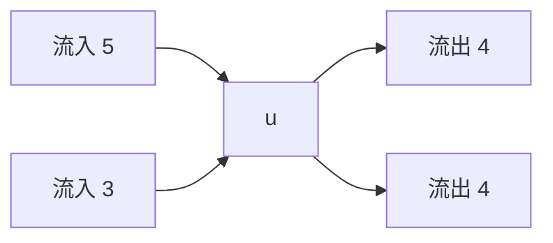

因為 `5 + 3 = 4 + 4`，所以符合守恆。

---

## 12. Residual Network 殘餘網路

殘餘容量代表：

> 目前還能再增加多少流量，或可以反悔退回多少流量。

若原本有邊 `(u,v)`：

```text
forward residual:  cf(u,v) = c(u,v) - f(u,v)
backward residual: cf(v,u) = f(u,v)
```

例：

```text
u -> v 容量 10，目前流量 6
```

殘餘圖：

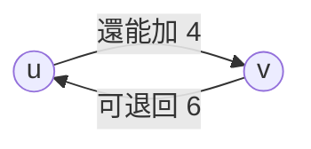

---

## 13. Augmenting Path 擴增路徑

在 residual network 中，從 `s` 到 `t` 的路徑叫 augmenting path。

這條路可以增加的流量：

```text
cf(p) = path 上所有 residual capacity 的最小值
```

例：

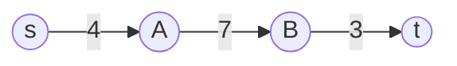

可增加量：

```text
min(4, 7, 3) = 3
```

---

## 14. Ford-Fulkerson Algorithm

演算法：

```text
FORD-FULKERSON(G, s, t)
1. for each edge (u,v):
2.     f(u,v) = 0
3. while exists augmenting path p in residual network Gf:
4.     cf(p) = min residual capacity on p
5.     for each edge (u,v) in p:
6.         if (u,v) is a forward edge:
7.             f(u,v) = f(u,v) + cf(p)
8.         if (u,v) is a backward edge:
9.             f(v,u) = f(v,u) - cf(p)
10. return f
```

重點：

- 找得到 augmenting path，就還不是最大流。
- 找不到 augmenting path，就已經是最大流。

---

## 15. Edmonds-Karp

Ford-Fulkerson 沒規定怎麼找 augmenting path。  
如果每次選很差的路，可能會跑很多次。

Edmonds-Karp 規定：

> 每次用 BFS 找 residual network 中邊數最少的 augmenting path。

複雜度：

```text
O(VE^2)
```

---

## 16. Cut 與 Max-Flow Min-Cut

一個 cut `(S,T)` 會把所有點分成兩邊：

```text
S ∪ T = V
s ∈ S
t ∈ T
```

cut capacity：

```text
c(S,T) = sum of capacities from S to T
```

最大流最小割定理：

```text
maximum flow = minimum cut capacity
```

等價條件：

1. `f` 是 maximum flow。
2. residual network 中沒有 augmenting path。
3. 存在 cut `(S,T)`，使得 `|f| = c(S,T)`。

---

## 17. Bipartite Matching 二分圖配對

二分圖：

```text
V = L ∪ R
```

每條邊都只能連接 `L` 和 `R`，不能同側相連。

Maximum bipartite matching 可以轉成 max flow：

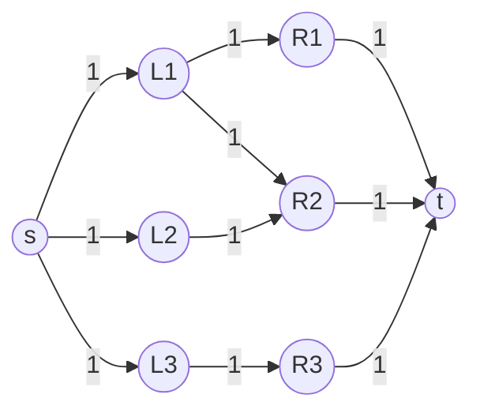

全部容量設為 1。  
最大流量值就是 maximum matching 的邊數。

---

## 18. 考卷題型：第 2 次小考 Q6，Ford-Fulkerson

題目要求：

> Apply Ford-Fulkerson algorithm using the shortest augmenting path method.

關鍵字是：

```text
shortest augmenting path
```

所以這題其實是在要求 Edmonds-Karp 思路：每次用 BFS 找邊數最少的 augmenting path。

題目圖大致如下：

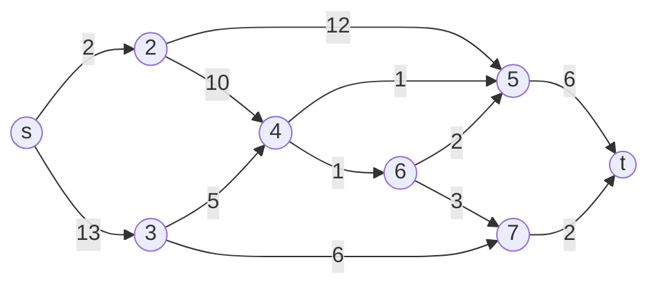

觀察：

- 流入 `t` 的邊只有 `5 -> t` 容量 6，`7 -> t` 容量 2。
- 所以最大流上限是 `6 + 2 = 8`。
- 但 source 端 `s -> 2` 只有 2，會限制上方路線。
- 考卷答案頁顯示最大流為 6；作答時要用 BFS 一次次畫 residual network，直到沒有 augmenting path。

考試作答模板：

| round | shortest augmenting path | cf(p) | total flow |
|---:|---|---:|---:|
| 1 | s -> ... -> t |  |  |
| 2 | s -> ... -> t |  |  |
| 3 | s -> ... -> t |  |  |

每輪都要：

1. 畫 residual network。
2. 找 BFS 最短 augmenting path。
3. 用 path 上最小 residual capacity 更新 flow。
4. 找不到 path 時停下。
5. 最後標出 min-cut。

---

# Part 3. Dynamic Programming 動態規劃

## 19. DP 是什麼？

Dynamic Programming, DP, 是一種：

> 把大問題拆成小問題，並把小問題答案存起來，避免重複計算。

適用條件：

1. **Optimal substructure 最佳子結構**  
   大問題最佳解可以由小問題最佳解組成。

2. **Overlapping subproblems 重疊子問題**  
   遞迴時同一個小問題會被重複計算。

---

## 20. Top-down 與 Bottom-up

## 20.1 Top-down Memoization

想法：

- 保留遞迴寫法。
- 每次進入遞迴前先查表。
- 算過就直接回傳。

## 20.2 Bottom-up

想法：

- 從最小問題開始填表。
- 填到大問題。
- 填某一格時，它需要的小問題都已經算完。

---

## 21. Fibonacci / Hen Problem

遞迴式：

```text
F(1) = 1
F(2) = 1
F(n) = F(n-1) + F(n-2)
```

遞迴版很慢，因為會重複計算：

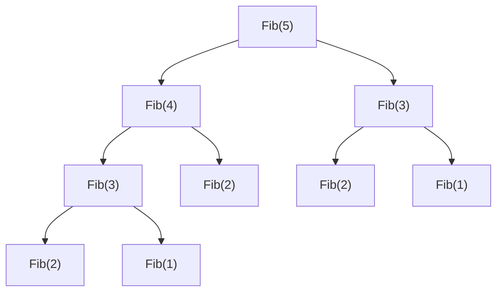

Bottom-up：

```cpp
int Fib(int n) {
    int f[n + 1];
    f[1] = 1;
    f[2] = 1;
    for (int i = 3; i <= n; i++) {
        f[i] = f[i - 1] + f[i - 2];
    }
    return f[n];
}
```

複雜度：

```text
Time: O(n)
Space: O(n)
```

---

## 22. Rod Cutting 鐵條切割

問題：

> 長度 `n` 的鐵條，每種長度 `i` 有價格 `p[i]`，求最大收益。

DP 定義：

```text
r[n] = 長度 n 的最大收益
```

轉移式：

```text
r[n] = max(p[i] + r[n-i]), 1 <= i <= n
r[0] = 0
```

圖：

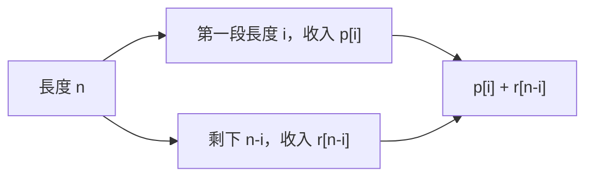

Bottom-up：

```text
for j = 1 to n:
    q = -∞
    for i = 1 to j:
        q = max(q, p[i] + r[j-i])
    r[j] = q
```

若要知道怎麼切，額外記錄：

```text
s[j] = 長度 j 時最佳第一刀的長度
```

---

## 23. 考卷題型：第 3 次小考 Q1，LCS

題目：

```text
X = polynomial
Y = exponential
```

要求：

1. 填 LCS DP table。
2. 找出 all optimal solutions。

## 23.1 LCS 定義

LCS = Longest Common Subsequence，最長共同子序列。

Subsequence 不需要連續，只要順序不變。

例：

```text
polynomial
exponential
```

共同子序列之一是：

```text
ponial
```

## 23.2 轉移式

令 `c[i][j]` 是：

> `X[1..i]` 和 `Y[1..j]` 的 LCS 長度。

```text
if X[i] == Y[j]:
    c[i][j] = c[i-1][j-1] + 1
else:
    c[i][j] = max(c[i-1][j], c[i][j-1])
```

對本題：

```text
LCS length = 6
all optimal solution = ponial
```

考試注意：

- 字元相同才走左上加 1。
- 字元不同就取上方或左方最大值。
- 如果上方與左方一樣大，代表可能有多個 optimal solution，要兩邊都追。

---

## 24. 考卷題型：第 3 次小考 Q2，Maximum Subarray

題目陣列：

```text
[-3, 1, -8, 4, -1, 2, 1, -5, 5]
```

目標：

> 找出連續的一段，使總和最大。

DP 定義：

```text
dp[i] = 一定要以第 i 個元素結尾的 maximum subarray sum
```

轉移式：

```text
dp[i] = max(A[i], dp[i-1] + A[i])
```

意思：

- 如果前面那段加上現在會更好，就接上。
- 如果前面那段是累贅，就從現在重新開始。

本題最佳：

```text
[4, -1, 2, 1]
sum = 6
```

---

## 25. 考卷題型：第 3 次小考 Q3，0/1 Knapsack

題目：

```text
W = 11
items:
1. w=1, v=1
2. w=2, v=6
3. w=4, v=14
4. w=6, v=20
5. w=7, v=25
```

## 25.1 DP 定義

```text
dp[i][w] = 只考慮前 i 個物品、容量上限 w 時的最大價值
```

轉移式：

```text
如果 wi > w:
    dp[i][w] = dp[i-1][w]
否則:
    dp[i][w] = max(
        dp[i-1][w],
        dp[i-1][w-wi] + vi
    )
```

意思：

1. 不拿第 `i` 個物品。
2. 拿第 `i` 個物品，剩下容量交給前 `i-1` 個物品。

本題 DP 表：

| item / capacity | 0 | 1 | 2 | 3 | 4 | 5 | 6 | 7 | 8 | 9 | 10 | 11 |
|---|---:|---:|---:|---:|---:|---:|---:|---:|---:|---:|---:|---:|
| none | 0 | 0 | 0 | 0 | 0 | 0 | 0 | 0 | 0 | 0 | 0 | 0 |
| w1=1,v1=1 | 0 | 1 | 1 | 1 | 1 | 1 | 1 | 1 | 1 | 1 | 1 | 1 |
| w2=2,v2=6 | 0 | 1 | 6 | 7 | 7 | 7 | 7 | 7 | 7 | 7 | 7 | 7 |
| w3=4,v3=14 | 0 | 1 | 6 | 7 | 14 | 15 | 20 | 21 | 21 | 21 | 21 | 21 |
| w4=6,v4=20 | 0 | 1 | 6 | 7 | 14 | 15 | 20 | 21 | 26 | 27 | 34 | 35 |
| w5=7,v5=25 | 0 | 1 | 6 | 7 | 14 | 15 | 20 | 25 | 26 | 31 | 34 | 39 |

最大值：

```text
39
```

最佳選擇：

```text
item 3 + item 5
weight = 4 + 7 = 11
value = 14 + 25 = 39
```

---

## 26. 考卷題型：第 3 次小考 Q4，Rod Cutting with Cut Cost

題目修改：

> 每切一刀要付固定成本 `c`。

所以如果真的切成兩段，要扣掉 `c`。  
如果完全不切，就不用扣成本。

## 26.1 轉移式

令：

```text
r[j] = 長度 j 的最大收益
```

兩種選擇：

1. 不切：收益 `p[j]`
2. 第一刀切出 `i`，剩下 `j-i`：收益 `p[i] + r[j-i] - c`

所以：

```text
r[j] = max(
    p[j],
    max(p[i] + r[j-i] - c), 1 <= i < j
)
```

注意 `i < j`，因為 `i = j` 代表沒切，不該扣成本。

## 26.2 Pseudocode

```text
MODIFIED-CUT-ROD(p, n, c)
    r[0] = 0
    for j = 1 to n:
        q = p[j]
        s[j] = j
        for i = 1 to j-1:
            if q < p[i] + r[j-i] - c:
                q = p[i] + r[j-i] - c
                s[j] = i
        r[j] = q
    return r, s
```

## 26.3 本題 c = 1

價格表：

| length | 1 | 2 | 3 | 4 | 5 | 6 | 7 | 8 | 9 | 10 |
|---|---:|---:|---:|---:|---:|---:|---:|---:|---:|---:|
| price | 1 | 4 | 5 | 9 | 10 | 12 | 15 | 18 | 19 | 20 |

計算結果：

| j | 1 | 2 | 3 | 4 | 5 | 6 | 7 | 8 | 9 | 10 |
|---|---:|---:|---:|---:|---:|---:|---:|---:|---:|---:|
| r[j] | 1 | 4 | 5 | 9 | 10 | 12 | 15 | 18 | 19 | 21 |
| s[j] | 1 | 2 | 3 | 4 | 5 | 6 | 7 | 8 | 9 | 2 |

長度 10 最佳：

```text
s[10] = 2
剩下 8
s[8] = 8
```

所以切法：

```text
10 = 2 + 8
收益 = p[2] + p[8] - 1 = 4 + 18 - 1 = 21
```

---

## 27. 考前速記

## 27.1 SSSP / APSP

- Relax 是最短路徑共同核心。
- Dijkstra 不能有負邊。
- Bellman-Ford 可負邊，可偵測負環，`O(VE)`。
- DAG shortest path 用 topological order，`O(V+E)`。
- Warshall 判斷可不可達。
- Floyd-Warshall 求所有點對最短路，`O(n^3)`。

## 27.2 Maximum Flow

- Flow 不能超過 capacity。
- 中間點 flow conservation：流入 = 流出。
- Residual network 有 forward edge 和 backward edge。
- Augmenting path 的可增加量是 path 上最小 residual capacity。
- Ford-Fulkerson：一直找 augmenting path。
- Edmonds-Karp：用 BFS 找 shortest augmenting path。
- Max-flow min-cut：最大流 = 最小 cut capacity。

## 27.3 Dynamic Programming

- DP 條件：最佳子結構 + 重疊子問題。
- Top-down = recursion + memoization。
- Bottom-up = 從小填表到大。
- LCS：

```text
same: c[i][j] = c[i-1][j-1] + 1
diff: c[i][j] = max(c[i-1][j], c[i][j-1])
```

- Maximum subarray：

```text
dp[i] = max(A[i], dp[i-1] + A[i])
```

- Knapsack：

```text
dp[i][w] = max(not take, take)
```

- Rod cutting：

```text
r[n] = max(p[i] + r[n-i])
```

- Rod cutting with cut cost：

```text
r[j] = max(p[j], p[i] + r[j-i] - c)
```

---

## 28. 這兩份考卷中「不是本次三份講義主軸」的題目

第 2 次小考：

- Q4：Minimum Spanning Tree, Kruskal / Prim
- Q5：Articulation point

第 3 次小考：

- Q5：Adjacency multi-list
- Q6：DFS / BFS traversal、edge type
- Q7：Topological sort，可跟 DAG shortest path 有關，但題目本身偏 DFS/topological sort trace

這些也屬於資料結構與演算法，但不是這次你給的三份課程講義主軸。若考試範圍包含它們，建議另外整理一份「圖論基本操作」筆記。

