# 資料結構與演算法 II 講義整理筆記

整理來源：

- `dinamic_programming.pdf` / `quiz2_dinamic.pdf`：Dynamic Programming
- `sssp_apsp.pdf`：Single-Source Shortest Paths、APSP
- `max_flow.pdf`：Maximum Flow

> `quiz2_dinamic.pdf` 與 `dinamic_programming.pdf` 內容看起來相同，所以筆記只整理一次 Dynamic Programming。

---

## 1. Dynamic Programming 動態規劃

### 1.1 DP 是什麼？

Dynamic Programming, DP, 是一種「把大問題拆成小問題，並把小問題答案存起來」的方法。

它特別適合兩種情況：

1. **Optimal substructure 最佳子結構**  
   大問題的最佳解，可以由小問題的最佳解組合而成。

2. **Overlapping subproblems 重疊子問題**  
   遞迴過程中，同一個小問題會被重複計算很多次。

簡單說：

> 如果你發現遞迴一直重算同一件事，就可以考慮 DP。

### 1.2 DP 和 Divide and Conquer 的差別

| 方法 | 子問題是否重疊 | 常見做法 | 例子 |
|---|---:|---|---|
| Divide and Conquer 分治法 | 通常不重疊 | 分開解，再合併 | Merge Sort |
| Dynamic Programming 動態規劃 | 常常重疊 | 解一次，存表格，下次直接查 | Fibonacci、Rod Cutting、Bellman-Ford、Floyd-Warshall |

### 1.3 DP 的標準四步驟

1. **描述最佳解的結構**  
   例如：長度 `n` 的鐵條最佳收益，來自「第一刀切長度 `i` + 剩下長度 `n-i` 的最佳收益」。

2. **遞迴定義最佳解的值**  
   寫出 recurrence relation。

3. **計算最佳解的值**  
   通常用 bottom-up 填表，或 top-down memoization。

4. **建構最佳解本身**  
   如果題目問「怎麼切」、「路徑是什麼」，就要額外記錄選擇。

---

## 2. Fibonacci / Hen Problem

### 2.1 問題定義

講義中的 Hen problem：

- Day 1 一開始有 1 隻母雞。
- 每隻母雞每天生 1 顆蛋。
- 每顆蛋 1 天後變成母雞。
- `F(n)` 表示第 `n` 天結束時母雞數量。

因為今天新增的雞來自「前兩天的雞生的蛋」，所以：

```text
F(1) = 1
F(2) = 1
F(n) = F(n-1) + F(n-2), n >= 3
```

這就是 Fibonacci number。

### 2.2 遞迴版為什麼慢？

```cpp
int Fib(int n) {
    if (n <= 2) return 1;
    return Fib(n - 1) + Fib(n - 2);
}
```

遞迴樹會重複算很多次：

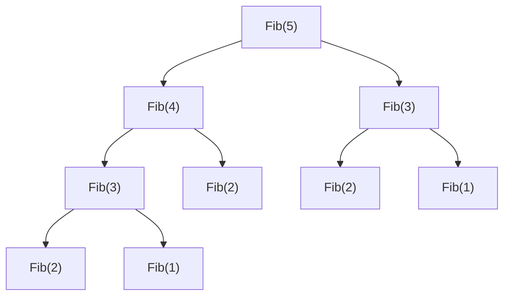

例如 `Fib(3)` 被算兩次，`Fib(2)` 被算三次。  
`n` 越大，重複越誇張，所以時間複雜度約為指數級。

### 2.3 Bottom-up DP 寫法

```cpp
int Fib2(int n) {
    int f[n + 1];
    f[1] = 1;
    f[2] = 1;

    for (int i = 3; i <= n; i++) {
        f[i] = f[i - 1] + f[i - 2];
    }

    return f[n];
}
```

複雜度：

- Time：`O(n)`
- Space：`O(n)`

也可以只保留前兩項，讓空間變成 `O(1)`。

---

## 3. Rod Cutting 鐵條切割問題

### 3.1 問題定義

給一根長度 `n` 的鐵條，以及每種長度的價格表 `p[i]`。  
目標：決定怎麼切，讓總收入最大。

講義價格表：

| 長度 i | 1 | 2 | 3 | 4 | 5 | 6 | 7 | 8 | 9 | 10 |
|---|---:|---:|---:|---:|---:|---:|---:|---:|---:|---:|
| 價格 p[i] | 1 | 5 | 8 | 9 | 10 | 17 | 17 | 20 | 24 | 30 |

例：長度 4

- 不切：`p[4] = 9`
- 切成 `2 + 2`：`p[2] + p[2] = 5 + 5 = 10`
- 切成 `1 + 3`：`1 + 8 = 9`

所以長度 4 的最大收益是 `10`，切法是 `2 + 2`。

### 3.2 遞迴關係式

令 `r[n]` 是長度 `n` 的最大收益。

第一刀可以切出長度 `i`，剩下長度 `n-i` 繼續用最佳切法：

```text
r[n] = max(p[i] + r[n-i]), 1 <= i <= n
r[0] = 0
```

圖像化：

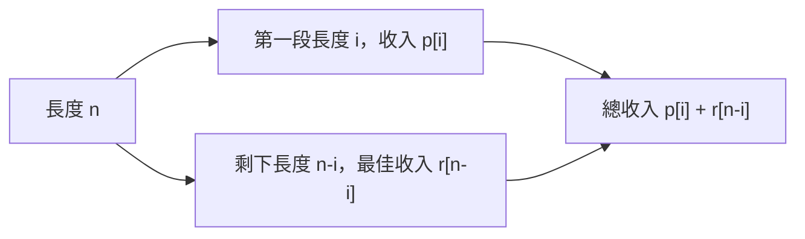

### 3.3 Top-down：遞迴加 Memoization

想法：還是用遞迴，但每次先查表。  
如果 `r[n]` 已經算過，就直接回傳。

```cpp
int MemoizedCutRodAux(int p[], int n, int r[]) {
    if (r[n] >= 0) return r[n];

    int q;
    if (n == 0) {
        q = 0;
    } else {
        q = -INF;
        for (int i = 1; i <= n; i++) {
            q = max(q, p[i] + MemoizedCutRodAux(p, n - i, r));
        }
    }

    r[n] = q;
    return q;
}
```

### 3.4 Bottom-up：由小到大填表

```cpp
int BottomUpCutRod(int p[], int n) {
    int r[n + 1];
    r[0] = 0;

    for (int j = 1; j <= n; j++) {
        int q = -INF;
        for (int i = 1; i <= j; i++) {
            q = max(q, p[i] + r[j - i]);
        }
        r[j] = q;
    }

    return r[n];
}
```

填表依賴關係：

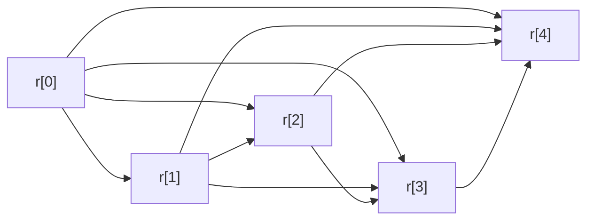

時間複雜度：

```text
1 + 2 + 3 + ... + n = O(n^2)
```

### 3.5 如何知道最佳切法？

只知道最大收益不夠，如果題目問「怎麼切」，要額外用 `s[j]` 記錄長度 `j` 時最佳的第一刀。

```cpp
ExtendedBottomUpCutRod(p, n):
    r[0] = 0
    for j = 1 to n:
        q = -INF
        for i = 1 to j:
            if q < p[i] + r[j-i]:
                q = p[i] + r[j-i]
                s[j] = i
        r[j] = q
    return r, s
```

印出切法：

```cpp
while (n > 0) {
    print s[n];
    n = n - s[n];
}
```

例：如果 `n = 8`，查表得到：

```text
s[8] = 2
s[6] = 6
```

所以切法是：

```text
8 = 2 + 6
```

---

## 4. DP 練習：蜜蜂問題

講義題目：

- 母蜂每年生 1 隻公蜂。
- 公蜂每年生 1 隻公蜂和 1 隻母蜂，然後死亡。
- 有一隻神奇母蜂永遠不死，且每年也會生 1 隻公蜂。
- 問 `N` 年後有幾隻公蜂、母蜂。

令：

- `M[n]`：第 `n` 年公蜂數
- `F[n]`：第 `n` 年母蜂數

初始：

```text
M[0] = 0
F[0] = 1
```

遞迴：

```text
M[n] = M[n-1] + F[n-1]
F[n] = M[n-1] + 1
```

表格：

| 年 | 公蜂 M | 母蜂 F |
|---:|---:|---:|
| 0 | 0 | 1 |
| 1 | 1 | 1 |
| 2 | 2 | 2 |
| 3 | 4 | 3 |
| 4 | 7 | 5 |
| 5 | 12 | 8 |
| 6 | 20 | 13 |
| 7 | 33 | 21 |

所以 `N = 7` 時：

```text
公蜂 = 33
母蜂 = 21
總數 = 54
```

---

## 5. Single-Source Shortest Paths 單源最短路徑

### 5.1 Relaxation 放鬆

最短路徑演算法的核心操作是 Relax。

假設目前：

- `u.d`：目前已知從 source 到 `u` 的距離
- `v.d`：目前已知從 source 到 `v` 的距離
- `w(u,v)`：邊 `(u,v)` 的權重

如果從 `u` 走到 `v` 更短，就更新：

```text
if v.d > u.d + w(u,v):
    v.d = u.d + w(u,v)
    v.pi = u
```

圖：

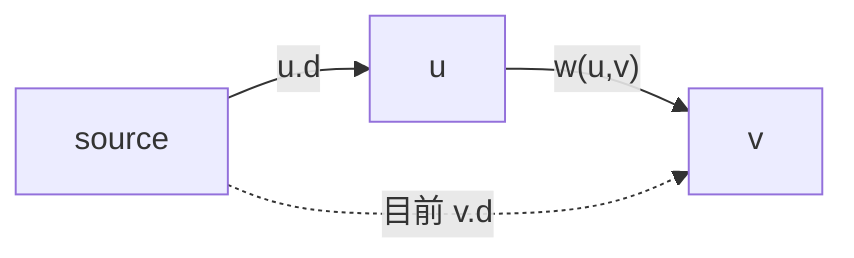

### 5.2 Dijkstra 的限制

Dijkstra 可以處理：

- 有向圖
- 無向圖
- 非負權重邊

不能處理：

- 有負權重的邊

原因：Dijkstra 每次選出目前距離最小的點後，就把它當成「已確定」。  
如果後面有負邊，可能又繞出更短的路，導致先前的確定結果錯誤。

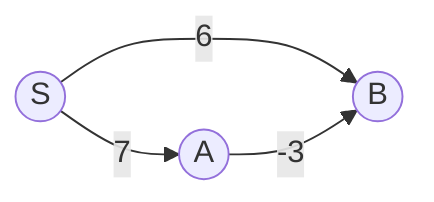

若先以為 `S -> B = 6`，但其實 `S -> A -> B = 7 + (-3) = 4` 更短。

---

## 6. Bellman-Ford Algorithm

### 6.1 Bellman-Ford 可以處理什麼？

Bellman-Ford 解 Single-Source Shortest Paths, SSSP。

它可以處理：

- 負權重邊
- 偵測從 source 可到達的負權重 cycle

不能處理：

- 有負環時，最短路徑沒有定義，因為可以一直繞負環讓距離變成負無限大。

### 6.2 演算法流程

```text
BELLMAN-FORD(G, w, s)
1. Initialize-Single-Source(G, s)
2. for i = 1 to |V|-1:
3.     for each edge (u, v) in E:
4.         RELAX(u, v, w)
5. for each edge (u, v) in E:
6.     if v.d > u.d + w(u,v):
7.         return FALSE
8. return TRUE
```

為什麼做 `|V|-1` 輪？

因為如果沒有重複點，一條 simple path 最多只會有 `|V|-1` 條邊。  
最短路徑不需要繞圈，所以最多放鬆 `|V|-1` 輪就夠。

### 6.3 負環判斷

做完 `|V|-1` 輪後，如果還能 relax，表示還能變更短。  
這代表存在負環。

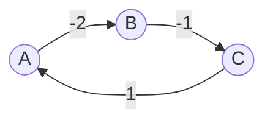

cycle 總權重：

```text
-2 + -1 + 1 = -2
```

一直繞會越來越小，所以沒有真正的 shortest path。

### 6.4 複雜度

```text
初始化：O(V)
放鬆 |V|-1 輪，每輪看所有邊：O(VE)
最後檢查負環：O(E)
總時間：O(VE)
```

---

## 7. DAG Shortest Path

### 7.1 DAG 是什麼？

DAG = Directed Acyclic Graph，有向無環圖。

特色：

- 邊有方向。
- 不存在 directed cycle。
- 因為沒有 cycle，所以不可能有負環。

### 7.2 Topological Sort 拓撲排序

如果有邊 `u -> v`，代表 `u` 必須排在 `v` 前面。

例：穿衣服順序。

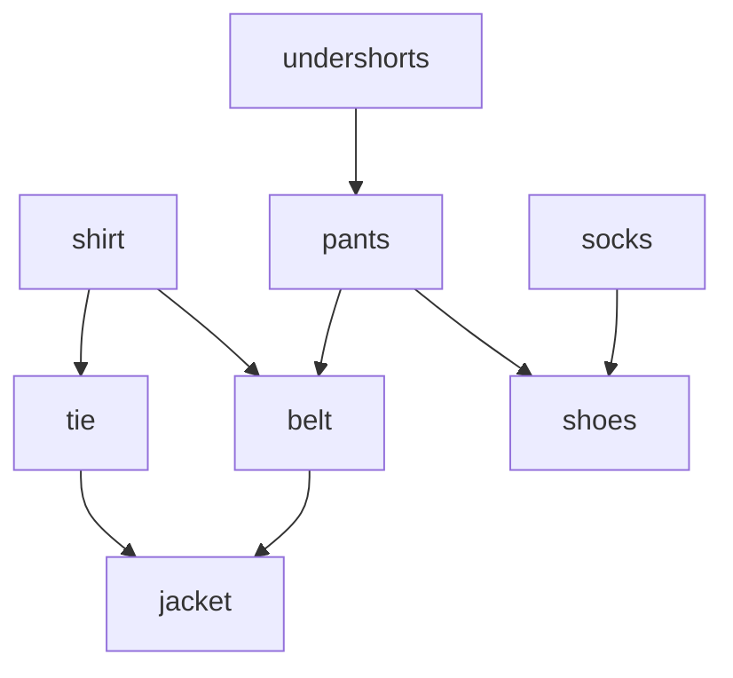

拓撲排序就是找一個合法順序，使每條邊的起點都在終點之前。

### 7.3 DAG Shortest Path 演算法

```text
DAG-SHORTEST-PATHS(G, w, s)
1. Topologically sort vertices
2. Initialize-Single-Source(G, s)
3. for each u in topological order:
4.     for each v in Adj[u]:
5.         RELAX(u, v, w)
```

複雜度：

```text
Topological sort: O(V+E)
Relax all edges once: O(E)
總時間：O(V+E)
```

比 Bellman-Ford 的 `O(VE)` 快很多。

---

## 8. APSP：All-Pairs Shortest Paths

### 8.1 APSP 是什麼？

SSSP 是：

> 從一個 source 到所有點的最短路徑。

APSP 是：

> 任意兩點 `i` 到 `j` 的最短路徑都要求出來。

可以把 SSSP 跑 `|V|` 次，但 Floyd-Warshall 會用 DP 更系統化地解。

---

## 9. Warshall：Transitive Closure 遞移閉包

### 9.1 問題定義

給一張有向圖，想知道每一對點 `(i,j)` 之間是否存在一條路徑。

`trans[i][j] = 1` 表示 `i` 可以到 `j`。  
`trans[i][j] = 0` 表示目前不知道或不能到。

### 9.2 核心想法

如果：

```text
trans[i][k] = 1
trans[k][j] = 1
```

那麼：

```text
trans[i][j] = 1
```

圖：

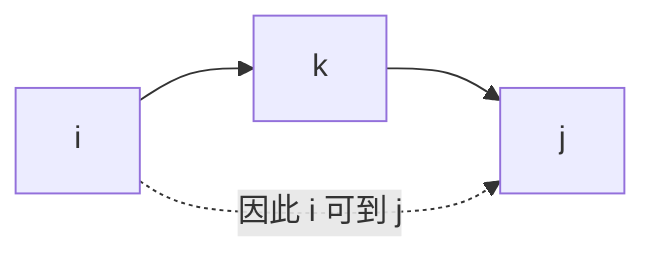

### 9.3 Warshall 演算法

```text
for k = 1 to n:
    for i = 1 to n:
        for j = 1 to n:
            trans[i][j] = trans[i][j] OR (trans[i][k] AND trans[k][j])
```

---

## 10. Floyd-Warshall Algorithm

### 10.1 問題定義

Floyd-Warshall 用來解 APSP。  
允許負權重邊，但不允許負環。

### 10.2 DP 定義

令 `D[k][i][j]` 表示：

> 從 `i` 到 `j` 的最短距離，且中繼點只能使用 `{1, 2, ..., k}`。

轉移式：

```text
D[k][i][j] = min(
    D[k-1][i][j],
    D[k-1][i][k] + D[k-1][k][j]
)
```

意思是：

1. 不經過 `k`：沿用原本的 `i -> j`
2. 經過 `k`：走 `i -> k -> j`

圖：

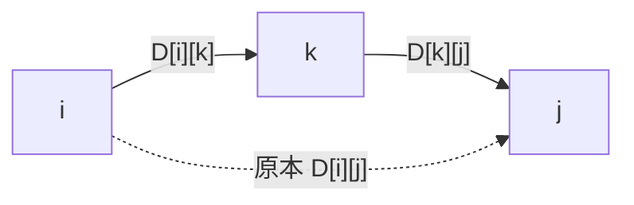

如果：

```text
D[i][j] > D[i][k] + D[k][j]
```

就更新：

```text
D[i][j] = D[i][k] + D[k][j]
```

### 10.3 演算法

```text
FLOYD-WARSHALL(W)
    D = W
    for k = 1 to n:
        for i = 1 to n:
            for j = 1 to n:
                D[i][j] = min(D[i][j], D[i][k] + D[k][j])
    return D
```

複雜度：

```text
Time: O(n^3)
Space: O(n^2) 如果只保留目前矩陣
```

### 10.4 例子

初始矩陣：

```text
      A   B   C   D
A     0   3   6   ∞
B     ∞   0   2   4
C     ∞   ∞   0  -1
D    -2   ∞   ∞   0
```

邊：

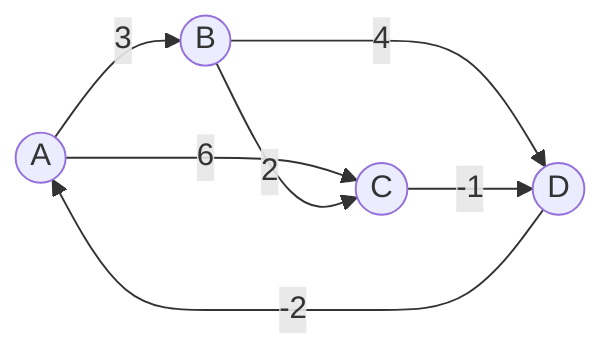

經過 Floyd-Warshall 後：

```text
      A   B   C   D
A     0   3   5   4
B    -1   0   2   1
C    -3   0   0  -1
D    -2   1   3   0
```

例如：

```text
A -> D 原本是 ∞
A -> B -> C -> D = 3 + 2 + (-1) = 4
```

所以 `D[A][D] = 4`。

### 10.5 Pi matrix 前驅矩陣

如果只求距離，用 `D` matrix。  
如果還要還原路徑，就要用 `Π` matrix 記錄前驅。

初始化：

```text
Π[i][j] = NIL, if i == j or w[i][j] = ∞
Π[i][j] = i,   if i != j and w[i][j] < ∞
```

更新時：

```text
如果 D[i][j] 因為 i -> k -> j 變短，
Π[i][j] = Π[k][j]
```

意思：  
`i` 到 `j` 的最短路徑最後一段，跟 `k` 到 `j` 的最後一段相同。

---

## 11. Maximum Flow 最大流

### 11.1 Flow Network 流量網路定義

Flow network 是一張有向圖 `G = (V, E)`，每條邊 `(u,v)` 有容量：

```text
c(u,v) >= 0
```

特殊點：

- `s`：source，源點
- `t`：sink，匯點

容量可以想成管線最大流量，例如每小時最多 200 加侖。

圖：

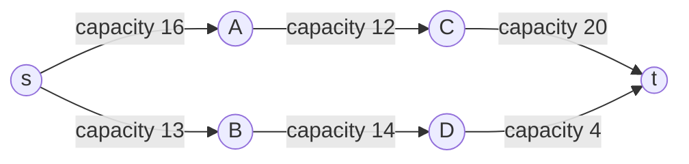

### 11.2 Flow 的兩個限制

#### 容量限制 Capacity Constraint

```text
0 <= f(u,v) <= c(u,v)
```

每條邊的流量不能小於 0，也不能超過容量。

#### 流量守恆 Flow Conservation

對除了 `s` 和 `t` 以外的每個點 `u`：

```text
流入 u 的總流量 = 流出 u 的總流量
```

中間節點不能憑空製造或消耗流量。

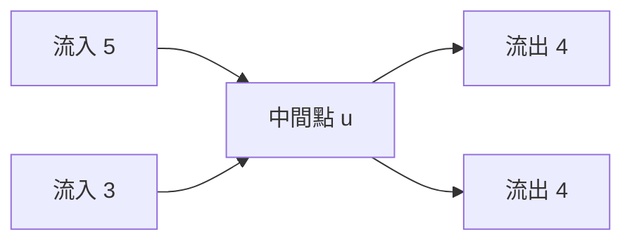

上圖符合守恆，因為 `5 + 3 = 4 + 4`。

### 11.3 Flow value

流量值 `|f|` 是 source 淨流出的量：

```text
|f| = 從 s 流出的總量 - 流入 s 的總量
```

在一般最大流問題中，可以直覺理解成：

```text
|f| = 最後流進 t 的總量
```

---

## 12. Residual Network 殘餘網路

### 12.1 Residual capacity 是什麼？

殘餘容量代表：

> 目前這條邊還能再多塞多少流量，或可以反悔退回多少流量。

若原本有邊 `(u,v)`：

```text
cf(u,v) = c(u,v) - f(u,v)
```

反向邊代表可以把已送出的流量退回：

```text
cf(v,u) = f(u,v)
```

例：

```text
u -> v 容量 10，目前流量 6
```

殘餘網路有：

```text
u -> v 還能加 4
v -> u 可以退 6
```

圖：

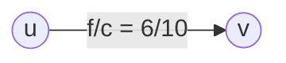

殘餘圖：

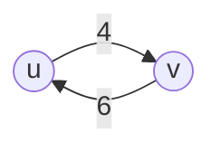

### 12.2 Augmenting Path 擴增路徑

在殘餘網路 `Gf` 中，從 `s` 到 `t` 的 simple path 稱為 augmenting path。

這條路還能增加的流量是路徑上最小的殘餘容量：

```text
cf(p) = min{ cf(u,v) : (u,v) 在 path p 上 }
```

例：

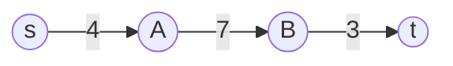

這條 path 的可增加量：

```text
min(4, 7, 3) = 3
```

所以最多只能再增加 3，因為最後一條邊卡住。

---

## 13. Ford-Fulkerson Algorithm

### 13.1 演算法想法

1. 一開始所有 flow 都是 0。
2. 建立殘餘網路。
3. 只要還找得到 `s -> t` 的 augmenting path，就沿著它增加流量。
4. 找不到 augmenting path 時，目前 flow 就是 maximum flow。

```text
FORD-FULKERSON(G, s, t)
1. for each edge (u,v):
2.     f(u,v) = 0
3. while exists augmenting path p in residual network Gf:
4.     cf(p) = min residual capacity on p
5.     for each edge (u,v) in p:
6.         f(u,v) = f(u,v) + cf(p)
7.         f(v,u) = f(v,u) - cf(p)
8. return f
```

### 13.2 為什麼選路徑很重要？

Ford-Fulkerson 沒規定怎麼找 augmenting path。  
如果每次都選到很差的路，可能一次只增加 1，跑很多次。

講義中的重點：

```text
Time: O(fmax * E)
```

其中 `fmax` 是最大流量值。  
如果最大流量很大，而每次只加一點，會很慢。

### 13.3 Edmonds-Karp

Edmonds-Karp 是 Ford-Fulkerson 的改良版：

> 每次用 BFS 找殘餘網路中從 `s` 到 `t` 的最短 augmenting path。

複雜度：

```text
O(VE^2)
```

---

## 14. Cut 與 Max-Flow Min-Cut

### 14.1 Cut 是什麼？

一個 cut `(S,T)` 是把所有 vertex 分成兩群：

```text
S ∪ T = V
S ∩ T = empty
s ∈ S
t ∈ T
```

圖：

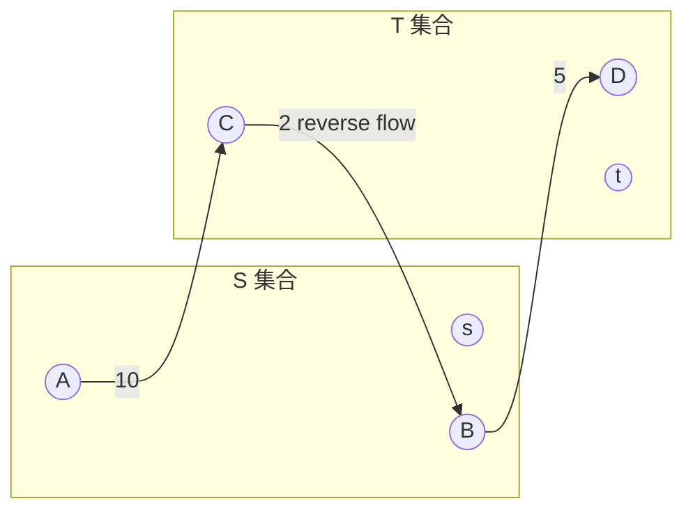

### 14.2 Cut capacity

Cut capacity 只算從 `S` 指向 `T` 的容量：

```text
c(S,T) = sum of c(u,v), where u in S and v in T
```

### 14.3 Net flow across cut

Cut 的淨流量：

```text
f(S,T) = S -> T 的流量 - T -> S 的流量
```

### 14.4 Max-flow Min-cut Theorem

最大流最小割定理：

> 一張 flow network 的最大流量，等於所有 cut 裡面最小的 cut capacity。

等價條件：

1. `f` 是 maximum flow。
2. residual network `Gf` 中沒有 augmenting path。
3. 存在某個 cut `(S,T)`，使得 `|f| = c(S,T)`。

直覺：

> 如果把圖切成 source 端和 sink 端，所有流量都必須穿過某個 cut。  
> 最窄的 cut 會限制整張網路最多能送多少流量。

---

## 15. Bipartite Matching 二分圖配對

### 15.1 Bipartite Graph

二分圖 `G = (V, E)` 可以把點分成兩邊：

```text
V = L ∪ R
```

每條邊都只能連接 `L` 和 `R`，不能同側相連。

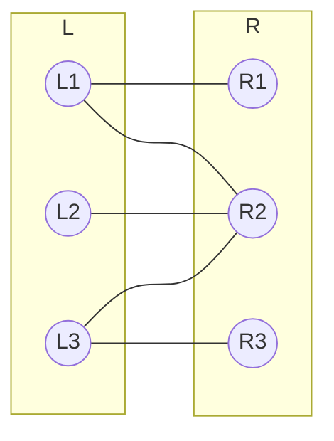

### 15.2 Matching

Matching 是一組邊，而且這些邊彼此不能共用端點。

例：

```text
{(L1,R1), (L2,R2), (L3,R3)}
```

是 matching，因為每個點只被用一次。

Maximum matching 是邊數最多的 matching。

### 15.3 用 Maximum Flow 解 Bipartite Matching

把二分圖轉成 flow network：

1. 新增 source `s` 和 sink `t`。
2. 從 `s` 連到所有 `L` 的點，容量設為 1。
3. 原本 `L -> R` 的邊容量設為 1。
4. 從所有 `R` 的點連到 `t`，容量設為 1。
5. 跑 Ford-Fulkerson。

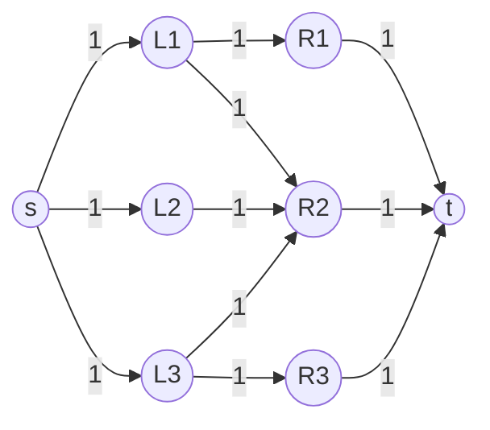

因為每條邊容量都是 1，所以每個點最多只能被配一次。  
最大流量值就是 maximum matching 的大小。

---

## 16. 考前速記

### Dynamic Programming

- 有重疊子問題 + 最佳子結構，就考慮 DP。
- Top-down = recursion + memoization。
- Bottom-up = 從小問題開始填表。
- Rod cutting recurrence：

```text
r[n] = max(p[i] + r[n-i]), 1 <= i <= n
```

### Shortest Path

- Relax：

```text
if v.d > u.d + w(u,v): update v
```

- Dijkstra：不能有負邊。
- Bellman-Ford：可負邊，可偵測負環，`O(VE)`。
- DAG shortest path：拓撲排序後 relax，`O(V+E)`。
- Floyd-Warshall：APSP，`O(n^3)`。

### Maximum Flow

- Flow network：有 source `s`、sink `t`、capacity `c(u,v)`。
- Capacity constraint：`0 <= f(u,v) <= c(u,v)`。
- Flow conservation：中間點流入 = 流出。
- Residual capacity：

```text
forward: c(u,v) - f(u,v)
backward: f(u,v)
```

- Augmenting path：殘餘網路中從 `s` 到 `t` 的路。
- Ford-Fulkerson：一直找 augmenting path。
- Edmonds-Karp：用 BFS 找 augmenting path。
- Max-flow min-cut：最大流 = 最小 cut capacity。
- Bipartite matching 可以轉成 maximum flow。

